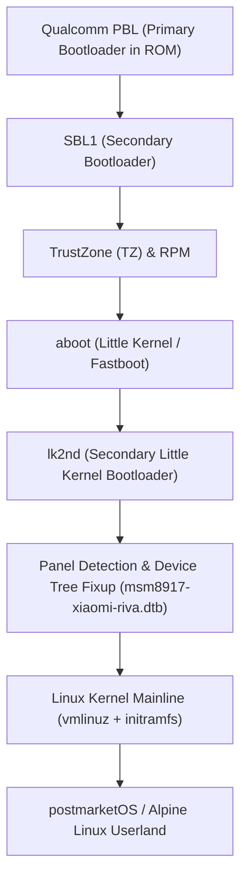

# Xiaomi Redmi 5A (riva) postmarketOS Port & Mainline Linux Server

[](https://postmarketos.org)
[](https://kernel.org)
[-orange.svg)]()
[]()
[](LICENSE)

Source repository and documentation for porting and deploying **Mainline Linux Kernel (7.1.x)** and **postmarketOS (Alpine Linux edge)** on the **Xiaomi Redmi 5A (`riva` / Qualcomm Snapdragon 425 MSM8917)**.

---

## Hardware Specifications

| Attribute | Specification |
| :--- | :--- |
| **Target Device** | Xiaomi Redmi 5A (Codename: `riva`, compatible with `rolex`) |
| **SoC** | Qualcomm Snapdragon 425 (MSM8917 / MSM8937 family) |
| **CPU Architecture** | Quad-Core ARM Cortex-A53 @ 1.401 GHz (ARMv8-A 64-bit) |
| **GPU** | Qualcomm Adreno 308 (Open-source `freedreno` / Mesa) |
| **RAM** | 2 GB LPDDR3 (~300 MB used at idle, **1.2+ GB free**) |
| **Storage** | 16 GB eMMC 5.1 |
| **Display** | 5.0" IPS LCD (720x1280, 60 Hz) |
| **Wireless** | Qualcomm WCN36xx (802.11 b/g/n, Bluetooth 4.1) |
| **Power / Battery** | 3000 mAh Li-Ion (Integrated battery backup) |

---

## Repository Structure

```text
.
├── README.md               # Main project documentation
├── LICENSE                 # MIT License
├── boot/
│   ├── extlinux.conf       # Extlinux bootloader configuration
│   ├── lk2nd.img           # Secondary Little Kernel bootloader
│   └── msm8917-xiaomi-riva.dtb # Compiled Device Tree Blob for Redmi 5A
├── port/
│   ├── device-qcom-msm89x7/
│   │   ├── APKBUILD        # postmarketOS device package recipe
│   │   ├── deviceinfo      # Hardware definition and flash mappings
│   │   └── modules-initfs  # Kernel modules loaded during initramfs stage
│   └── linux-postmarketos-qcom-msm89x7/
│       ├── APKBUILD        # Mainline Linux kernel package definition
│       └── config-postmarketos-qcom-msm89x7.aarch64 # Kernel kconfig (Linux 7.1.x)
├── scripts/
│   ├── build-kernel.sh     # Script to compile kernel and device packages
│   ├── build-recovery-zip.sh # Script to build TWRP flashable installer ZIP
│   ├── flash-twrp.sh       # Automation script to push and flash via recovery
│   └── screen-control.sh   # Utility script to control LCD backlight via sysfs
└── docs/
    ├── BOOT_FLOW.md        # Technical explanation of Qualcomm boot sequence
    ├── KERNEL_CONFIG.md    # Kernel configuration and enabled hardware drivers
    └── TROUBLESHOOTING.md  # Detailed troubleshooting solutions
```

---

## Boot Architecture Overview



---

## Build & Installation Guide

### 1. Host Requirements (Linux)
Install `pmbootstrap` in a Python virtual environment on your Linux host:
```bash
python3 -m venv ~/.local/share/pmbootstrap-venv
~/.local/share/pmbootstrap-venv/bin/pip install --upgrade pmbootstrap
```

### 2. Configure Build Target
```bash
~/.local/share/pmbootstrap-venv/bin/pmbootstrap config device qcom-msm89x7
~/.local/share/pmbootstrap-venv/bin/pmbootstrap config ui console
~/.local/share/pmbootstrap-venv/bin/pmbootstrap config user user
~/.local/share/pmbootstrap-venv/bin/pmbootstrap config extra_packages "openssh,htop,nano,tmux,neofetch,curl,git"
```

### 3. Build Recovery Installer ZIP
Generate the TWRP-compatible installation package:
```bash
./scripts/build-recovery-zip.sh
```

### 4. Flash to Device via Recovery (TWRP / OrangeFox / PitchBlack)
1. Boot the phone into **Recovery Mode** by holding `Power + Volume Up`.
2. Connect the phone to the host PC via USB cable.
3. Run the automated flash script:
   ```bash
   ./scripts/flash-twrp.sh
   ```
4. Once completed, reboot the device:
   ```bash
   adb reboot
   ```

---

## Post-Installation Management

### Remote Access
* **USB Network Interface (CDC-NCM):**
  ```bash
  ssh user@172.16.42.1
  ```
* **Local Wi-Fi Network:**
  ```bash
  ssh user@<WIFI_IP_ADDRESS>
  ```
* **Tailscale Mesh VPN (Global):**
  ```bash
  ssh user@<TAILSCALE_IP_ADDRESS>
  ```

### Screen & Power Management
To maximize battery life and minimize thermal output, the LCD backlight can be controlled directly via sysfs:
```bash
# Turn off LCD backlight completely (0% brightness):
sudo ./scripts/screen-control.sh off

# Dim screen to minimum visible level (10/255):
sudo ./scripts/screen-control.sh dim

# Restore normal brightness (128/255):
sudo ./scripts/screen-control.sh on
```

---

## Technical Documentation
* [Boot Sequence & Partition Layout](docs/BOOT_FLOW.md)
* [Kernel Configuration Details](docs/KERNEL_CONFIG.md)
* [Troubleshooting & Bug Fixes](docs/TROUBLESHOOTING.md)

---

## License
This project is licensed under the [MIT License](LICENSE).
