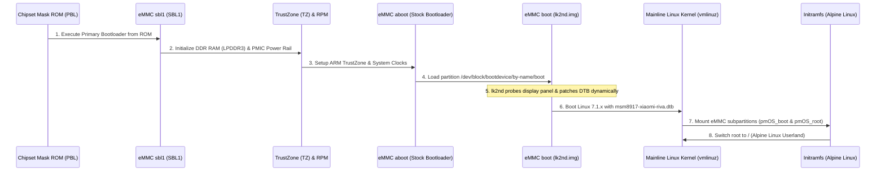

# Boot Sequence & Partition Architecture

This document describes the low-level hardware initialization sequence and partition structure of the Xiaomi Redmi 5A (`riva` / Qualcomm MSM8917).

---

## Boot Sequence Diagram

---

## Critical eMMC Partition Mapping

| Partition Name | Device Node | Purpose |
| :--- | :--- | :--- |
| `boot` | `/dev/block/mmcblk0p21` | Contains the **`lk2nd.img`** binary (Secondary Little Kernel). |
| `system` | `/dev/block/mmcblk0p24` | Partitioned into subpartitions: `pmOS_boot` (ext2) and `pmOS_root` (ext4). |
| `userdata`| `/dev/block/mmcblk0p49` | Extended storage space or alternative rootfs. |
| `modem` | `/dev/block/mmcblk0p1` | Qualcomm Baseband and Wi-Fi/BT firmware (`msm-firmware-loader`). |
| `dsp` | `/dev/block/mmcblk0p12` | Hexagon DSP firmware for audio and subsystem coprocessors. |
| `persist` | `/dev/block/mmcblk0p26` | Persistent hardware calibration data (Wi-Fi MAC, sensors). |

---

## Role of `lk2nd` (Secondary Little Kernel)

On Qualcomm platforms, the stock Android bootloader (`aboot`) cannot directly boot modern Mainline Linux kernels due to differences in device tree handling and display timing initialization.

1. **Hardware Panel Probing:** Probes the physical LCD panel connected via MIPI DSI (Novatek, FocalTech, ILI9881, etc.).
2. **Device Tree Patching:** Injects the probed display parameters into the device tree blob (`msm8917-xiaomi-riva.dtb`) at runtime.
3. **Standard Boot Protocol:** Loads standard `extlinux.conf` configurations, eliminating the need to modify stock bootloader partitions.
